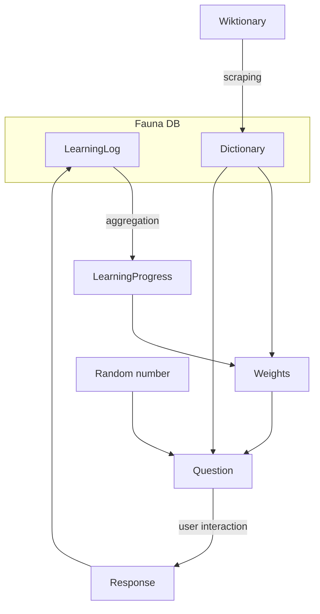

# Lernkartei v2

## Architecture overview

```mermaid

flowchart TB
  subgraph Fauna["Fauna DB"]
  LearningLog
  Dictionary
  end

  LearningLog --->|aggregation| LearningProgress ---> Weights
  Wiktionary --->|scraping| Dictionary
  Dictionary ---> Weights
  r["Random number"] ---> Question
  Weights ---> Question
  Dictionary ---> Question
  Question --->|user interaction| Response
  Response ---> LearningLog
```